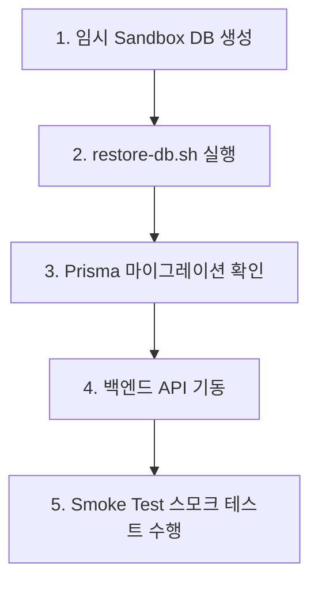

# CrocHub Database & Media Backup/Restore Runbook

이 문서는 시스템 엔지니어 및 운영자용 데이터베이스 재해 복구(Disaster Recovery) 명세서입니다.

---

## 1. 데이터베이스 백업 지침 (`backup-db.sh`)

백업 자동화 스크립트는 백엔드 디렉터리 하단에 위치하고 있으며, 환경변수 파일(`.env`)에서 자격 증명을 로딩하여 안전하게 가동됩니다.

```bash
# 기본 `./backups` 폴더에 백업 실행
./backend/scripts/backup-db.sh

# 백업 폴더를 직접 커스텀 지정하여 실행
./backend/scripts/backup-db.sh /path/to/backup-destination
```

### 백업 수행 후 생성 자산
1. **`crochub_backup_[YYYYMMDD_HHMMSS].sql.gz`**: 압축된 구조/데이터 MySQL 덤프 파일.
2. **`crochub_backup_[YYYYMMDD_HHMMSS].sql.gz.md5`**: 데이터 정합성 검증을 위한 MD5 체크섬 검증용 메타 파일.

---

## 2. 데이터베이스 복원 지침 (`restore-db.sh`)

장애 상황 혹은 샌드박스 검증을 위해 백업된 아카이브 파일로부터 데이터를 이식합니다.

> [!CAUTION]
> 이 스크립트는 대상 데이터베이스의 모든 기존 테이블과 데이터를 파괴 및 덮어쓰기하므로 매우 신중하게 조작해야 합니다.

### 안전 보호 장치 (Safeguards)
* **Production 차단**: `.env` 설정에 `NODE_ENV=production`이 명시된 경우, `--force` 인수를 넘기지 않으면 스크립트가 실행을 즉시 거부하고 비정상 종료됩니다.
* **무중단 비대화형(CI/CD) 자동화**: 대화형 프롬프트를 건너뛰려면 `--yes` 플래그를 추가하십시오.
* **체크섬 정합성 대조**: 아카이브 경로와 동등 레벨에 `.md5` 파일이 있다면 복원 착수 직전에 데이터 손상 유무를 검사합니다.

### 실행 예시
```bash
# 개발서버 환경 인터랙티브 복원 (대화형 예/아니오 대기)
./backend/scripts/restore-db.sh ./backups/crochub_backup_20260507_120000.sql.gz

# 특정 테스트 DB에 강제 비대화형 복원 실행 (무점검 자동화)
./backend/scripts/restore-db.sh ./backups/crochub_backup_20260507_120000.sql.gz --target crochub_sandbox --yes
```

---

## 3. R2/S3 클라우드 미디어 백업 및 안전 보장 가이드

미디어 파일은 바이너리 특성상 데이터베이스 덤프 범위에서 완전히 분리되며, Cloudflare R2 스토리지의 인프라 백업 시스템을 결합합니다.

### A. Lifecycle 및 Versioning (버전 관리 보존법)
* **R2 Bucket Versioning**: **활성화(Enabled) 권장**
  * 실수 혹은 공격자에 의해 파일이 변조되거나 삭제되더라도 구 버전을 30일 동안 영구 보관하여 즉각 복구할 수 있는 완충망을 둡니다.
* **Lifecycle Rule 정책**:
  * 비활성화된 이전 버전(Noncurrent versions)은 `30일` 경과 시 최종 소멸하도록 생명 주기를 구성합니다.

### B. 미디어 삭제 방지 및 이중 백업 정책
* **Cloudflare Bucket Lock / Deletion Protection**:
  * 버킷 자체의 실수 삭제 방지 정책을 활성화합니다.
* **Media Manifest Export**:
  * 데이터베이스의 `media` 테이블 및 `media_derivatives` 테이블을 정기 덤프하여 미디어가 실소실되더라도 파일 이름, 소유 정보, S3 고유 Key 맵이 명확한 구조로 남아 있어 복구가 수월하도록 동기화합니다.

---

## 4. 리허설 시나리오 (Sandboxed Restore Rehearsal)

데이터 정합성과 비상시 정상 가동 여부를 일주일에 1회씩 리허설 테스트하여 무정체 운용을 준수해야 합니다.



### 상세 절차
1. **임시 DB 풀 생성**:
   ```bash
   # 로컬 또는 컨테이너에서 임시 샌드박스 생성
   docker compose exec db mysql -u root -p"${MYSQL_ROOT_PASSWORD}" -e "CREATE DATABASE IF NOT EXISTS crochub_rehearsal;"
   ```
2. **백업 이식**:
   ```bash
   ./backend/scripts/restore-db.sh ./backups/crochub_backup_latest.sql.gz --target crochub_rehearsal --yes
   ```
3. **스키마 및 마이그레이션 호환 검증**:
   임시 DB로 백엔드 환경을 교체(혹은 `DATABASE_URL` 일시 치환)한 다음 마이그레이션 싱크를 조회합니다.
   ```bash
   npx prisma migrate status
   ```
4. **API 기동 및 핵심 루트 스모크 테스트**:
   * `curl -I http://localhost:3000/api/health` 응답 상태 검출.
   * `curl http://localhost:3000/sitemap.xml` 응답 데이터 내보내기 검사.
   * 테스트 DB 삭제:
     ```bash
     docker compose exec db mysql -u root -p"${MYSQL_ROOT_PASSWORD}" -e "DROP DATABASE crochub_rehearsal;"
     ```
