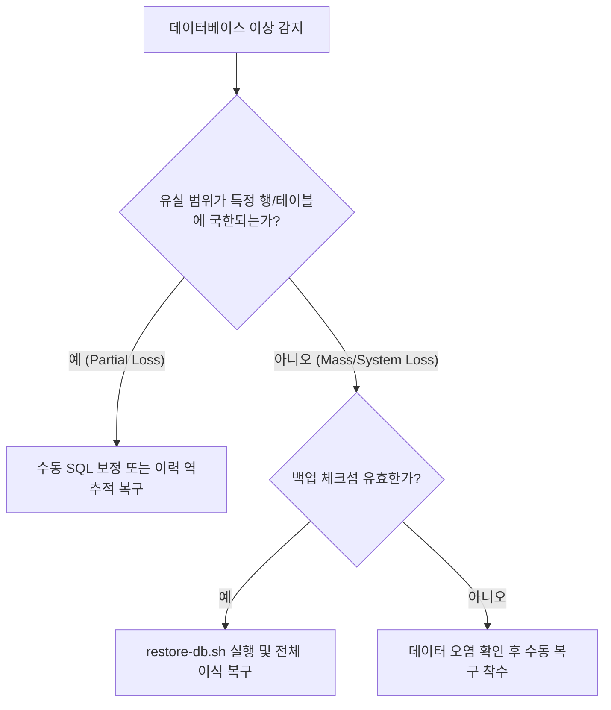

# CrocHub Incident Response & Recovery Playbook

이 문서는 서비스 장애 상황(System Incident)이 발생했을 때 신속하게 가동해야 할 긴급 대응 가이드북(Runbook)입니다.

---

## 1. 장애 심각도 등급 분류 (Incident Severity Matrix)

| 등급 (Severity) | 정의 (Definition) | 기준 예시 (Examples) | 타겟 복구 시간 (Target RTO) |
| :--- | :--- | :--- | :--- |
| **P1** (Critical) | 핵심 서비스가 완전히 중단되거나 민감 데이터 누출 사고 발생 | 데이터베이스 손상, 해킹 침투 의심, 어드민 권한 탈취 | **1시간 이내** |
| **P2** (Major) | 일부 핵심 기능 오동작 또는 심각한 지연 발생 | 이메일/Push 전송 일시 불가, 미디어 로딩 60% 이상 실패, 썸네일 생성 영구 롤백 | **4시간 이내** |
| **P3** (Minor) | 사소한 버그, UI 미적 롤백, 영향도가 한정된 오류 | 블로그 카테고리 스타일 깨짐, 단순 로그 경고 다수 발생 | **24시간 이내** |

---

## 2. 롤백 대응 절차 (Deployment Rollback Runbooks)

빌드 배포 후 비정상적인 버그나 셧다운 발생 시 즉시 복구 절차를 이행합니다.

### A. 백엔드(API) 롤백 절차
1. **이전 태그 확인 및 복귀**:
   개발 혹은 배포 리포지토리의 이전 안정 Git 해시 또는 태그를 검증합니다.
   ```bash
   git log --oneline -n 10
   ```
2. **Docker 이미지 롤백**:
   * 만약 Docker Registry에 빌드 이미지가 저장되어 있다면, 태그를 `latest`에서 직전 빌드 넘버(예: `v1.2.3`)로 재조정하여 재기동합니다.
   ```bash
   # docker-compose.yml 내 api 이미지 변경 후 재배포
   docker compose up -d --force-recreate api
   ```

### B. 프론트엔드 롤백 절차
* Vite 기반의 정적 번들을 CDN / Nginx가 서빙하고 있다면, 빌드가 보관되어 있던 직전 백업 릴리즈 폴더로 Nginx root 경로를 신속하게 포인팅 전환하고 Nginx를 리로드합니다.
  ```bash
  # Nginx 무중단 리로드
  docker compose exec nginx nginx -s reload
  ```

---

## 3. 데이터베이스 유실/손상 대응 (Database Recovery Criteria)

데이터베이스 손상이 감지될 시, 부분 수정(Partial Update)으로 복원할지 전체 복원(Full Restore)할지 냉철히 구획합니다.



### 판정 및 전술 지침
1. **부분 유실 (Partial Loss)**:
   * **상황**: 특정 게시물 1개가 임의로 딜리트됨, 단일 댓글 스레드 손상.
   * **조치**: 전체 데이터베이스를 덮어씌울 시 해당 백업 이후에 새로 쓰여진 회원 데이터나 댓글이 일제히 날아가는 2차 재해를 겪게 됩니다. 따라서 백업 파일을 개발서버/로컬 샌드박스에 임시 복원한 후, **해당 유실 데이터만 수동으로 추출(Export)하여 프로덕션에 인서트**하는 전술을 구사합니다.
2. **치명적/전체 유실 (Mass Loss / System Corruption)**:
   * **상황**: 해커 침투에 의한 테이블 드롭, 악성 스키마 마이그레이션 실패에 따른 DB 전체 인덱스 전멸.
   * **조치**: 서비스 점검 모드로 돌입시킨 다음, 가장 신뢰할 만한 최근 일자의 `crochub_backup_*.sql.gz`를 사용하여 전체 복구(Full Restore)를 단행합니다.

---

## 4. 비밀 자격증명 누출 사고 대응 (Secret Leaks Mitigation Plan)

`.env` 환경변수 키(MySQL 비밀번호, JWT_SECRET, Cloudflare API Key 등)가 GitHub 리포지토리 퍼블릭에 오인 업로드되었거나 외부 공격에 해킹당했을 시 조치 방법입니다.

1. **침투 차단 (Disable Key)**:
   * Cloudflare 대시보드 진입 후 침투당한 S3/R2 API Credentials(`R2_ACCESS_KEY_ID`, `R2_SECRET_ACCESS_KEY`)를 **즉시 무효화(Revoke)**하고 새로운 대체 비밀 키 쌍을 재생성합니다.
2. **서버 환경변수 교체**:
   * 즉각적으로 실제 프로덕션 서버 호스트 환경변수(`.env`)를 새로운 난수 키 쌍으로 덮어씁니다.
3. **토큰 전면 강제 무효화**:
   * `JWT_SECRET`이 노출되었을 경우, 기존 서명된 모든 유저 토큰이 도용될 수 있으므로 `JWT_SECRET` 값을 전면 재생성합니다. (동시 로그인되어 있던 사용자는 모두 자동 로그아웃됩니다.)
4. **Prisma DB 비밀번호 교체**:
   * `DATABASE_URL`에 바인딩되어 있던 DB 유저 비밀번호를 호스트 및 MySQL 터미널에서 신속하게 롤 오버(Roll over) 처리합니다.

---

## 5. R2 스토리지 미디어 삭제 사고 대응 (Media Deletion Recovery)

미디어가 실수로 S3 상에서 영구 파괴되거나 지워졌을 때 복구 궤적입니다.

* **1단계 (CF R2 Versioning 추적)**:
  Cloudflare R2 버킷은 30일간 버전 관리(Versioning)가 활성화되어 있습니다.
  R2 대시보드 또는 AWS CLI S3 도구를 사용해 지워진 파일의 '이전 버전(Older Versions)'이 잔존하는지 목록을 수색합니다.
* **2단계 (원본 복귀)**:
  삭제 표식(Delete Marker)이 추가되어 미디어가 겉보기로 사라진 경우, 해당 삭제 표식을 딜리트해 줌으로써 오리지널 미디어 파일을 유실 없이 원격 즉각 복원시킵니다.
* **3단계 (썸네일 복원)**:
  만약 `derivatives` 파일만 지워진 것이라면, 데이터베이스 레코드가 온전히 살아있으므로 어드민 미디어 라이브러리 화면에서 **"썸네일 재생성 (Regenerate)"** 마이크로 버튼을 원버튼 클릭하여 단숨에 전체 재생성 처리합니다.
